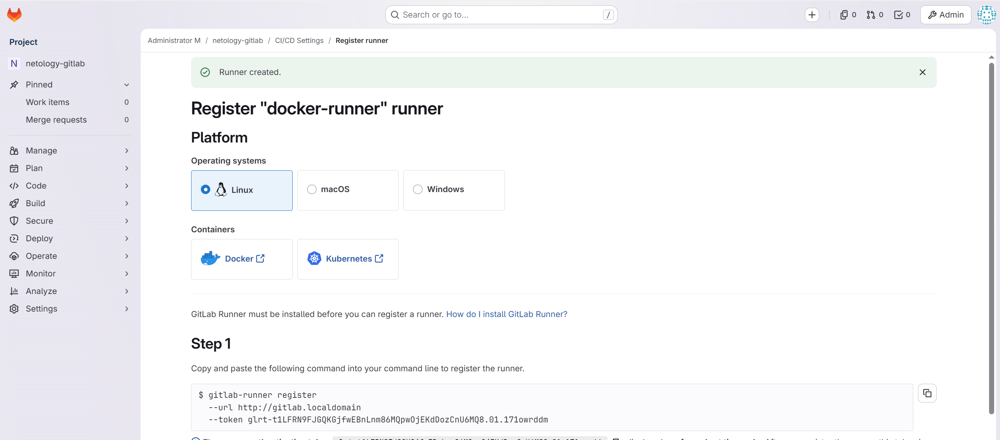
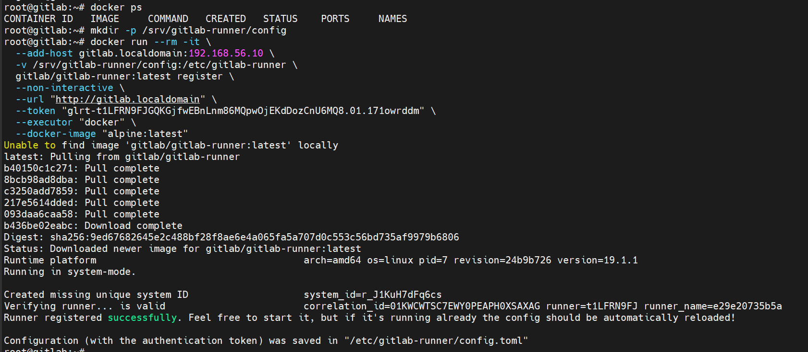
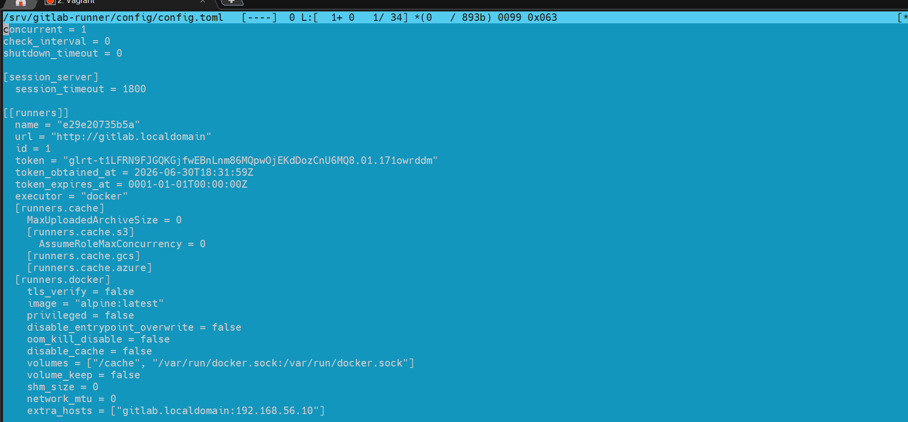
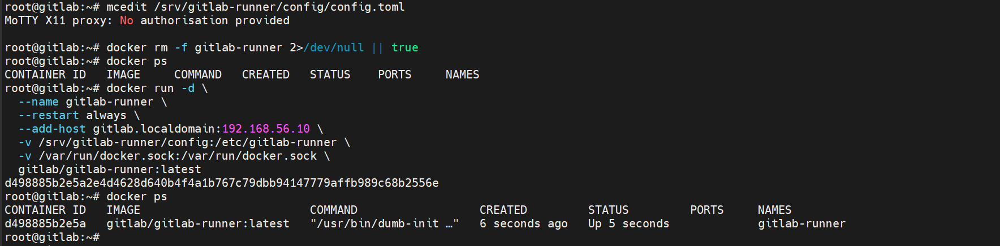
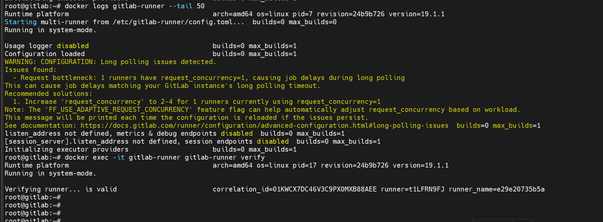
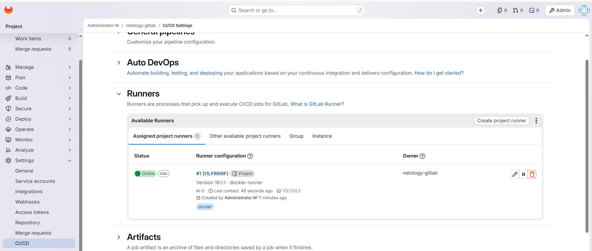
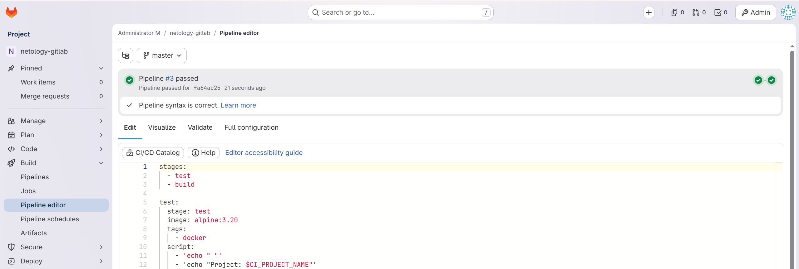
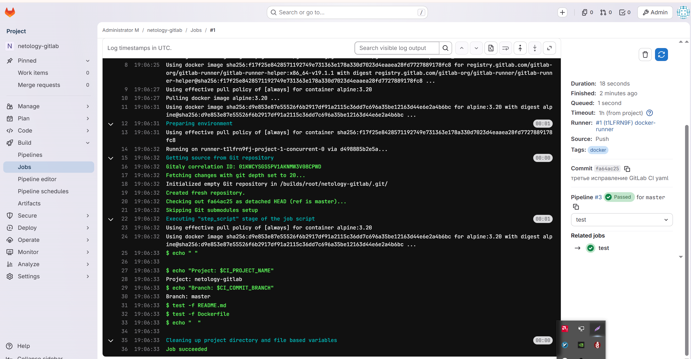
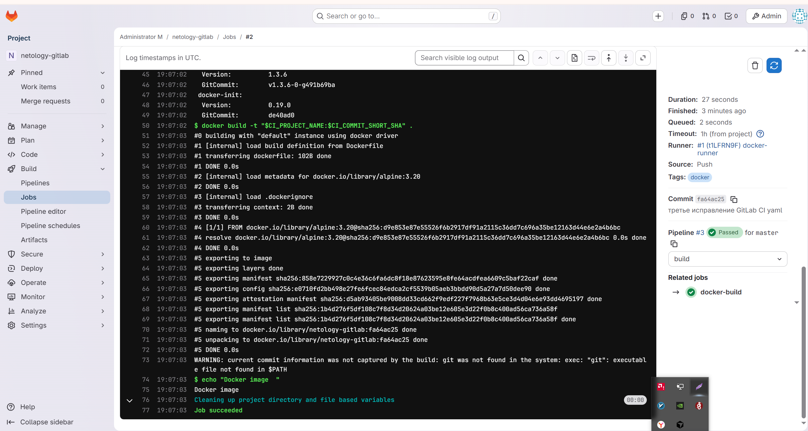

# Домашнее задание к занятию "`8-03 GitLab`" - `Насибуллин Михаил`


### Инструкция по выполнению домашнего задания

1. Сделайте fork  репозитория шаблоном решения к себе в GitHub и переименуйте его по названию или номеру занятия, например, github.com.../gitlab-hw или github.com...ия/8-03-hw.
2. Выполните клонирование этого репозитория к себе на ПК с помощью команды git clone.
3. Выполните домашнее задание и заполните у себя локально этот файл README.md:
   - впишите сверху название занятия, ваши фамилию и имя;
   - в каждом задании добавьте решение в требуемом виде — текст, код, скриншоты, ссылка.
   - для корректного добавления скриншотов используйте инструкцию «Как вставить скриншот в шаблон с решением»;
   - при оформлении используйте возможности языка разметки md. Коротко об этом можно посмотреть в инструкции по MarkDown.
4. После завершения работы над домашним заданием сделайте коммит git commit -m “comment” и отправьте его на GitHub git push origin.
5. Любые вопросы по выполнению заданий задавайте в разделе «Вопросы по заданию» в личном кабинете.
   
Желаем успехов в выполнении домашнего задания!
   
### Дополнительные материалы, которые могут быть полезны для выполнения задания

1. [Руководство по оформлению Markdown файлов](https://gist.github.com/Jekins/2bf2d0638163f1294637#Code)

---

### Задание 1
Что нужно сделать:

1. Разверните GitLab локально, используя Vagrantfile и инструкцию, описанные в этом репозитории.
2. Создайте новый проект и пустой репозиторий в нём.
3. Зарегистрируйте gitlab-runner для этого проекта и запустите его в режиме Docker. Раннер можно регистрировать и запускать на той же виртуальной машине, на которой запущен GitLab.
4. В качестве ответа в репозиторий шаблона с решением добавьте скриншоты с настройками раннера в проекте.









---

### Задание 2
Что нужно сделать:

Запушьте репозиторий на GitLab, изменив origin. Это изучалось на занятии по Git.
Создайте .gitlab-ci.yml, описав в нём все необходимые, на ваш взгляд, этапы.
В качестве ответа в шаблон с решением добавьте:

файл gitlab-ci.yml для своего проекта или вставьте код в соответствующее поле в шаблоне;
скриншоты с успешно собранными сборками.





Содержимое файла .gitlab-ci.yml
```
stages:
  - test
  - build

test:
  stage: test
  image: alpine:3.20
  tags:
    - docker
  script:
    - 'echo "Запуск теста"'
    - 'echo "Project: $CI_PROJECT_NAME"'
    - 'echo "Branch: $CI_COMMIT_BRANCH"'
    - 'test -f README.md'
    - 'test -f Dockerfile'
    - 'echo "Тест успешно выполнен"'

docker-build:
  stage: build
  image: docker:24.0.7
  tags:
    - docker
  script:
    - 'echo "Запуск сборки в docker"'
    - 'docker version'
    - 'docker build -t "$CI_PROJECT_NAME:$CI_COMMIT_SHORT_SHA" .'
    - 'echo "Docker image успешно собран"'
```


